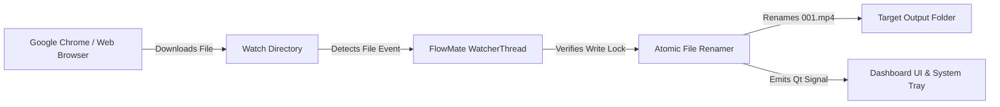

<div align="center">

# ⚡ FlowMate

### *Automated Sequential Video Renamer & File Management Engine*

[](https://www.python.org/)
[](https://pypi.org/project/PySide6/)
[](#-installation)
[](LICENSE)

*FlowMate automatically detects completed browser downloads (Google Chrome, Edge, Firefox), renames files sequentially (e.g. `001.mp4`, `002.mp4`), and organizes them into project directories in real time.*

[Key Features](#-key-features) •
[Installation](#-installation) •
[Quick Start](#-quick-start) •
[Architecture](#-architecture) •
[Cross-Platform](#-cross-platform-support) •
[License](#-license)

---

</div>

## 📖 Overview

When producing video content, downloading multiple video clips manually one-by-one from web tools or Google Chrome often leads to messy download folders filled with unorganized default filenames (e.g. `download (1).mp4`, `videoplayback.mp4`).

**FlowMate** solves this workflow bottleneck. Operating silently in the background, FlowMate monitors your browser download directory, waits for file write completion to ensure zero data corruption, automatically renames the files in numeric sequence (`001.mp4`, `002.mp4`, `003.mp4`...), and instantly relocates them into designated output project folders.

---

## ✨ Key Features

- **⚡ Real-time Directory Monitoring**: Powered by native OS file system events (`watchdog`) to instantly detect new downloads without high CPU polling.
- **🛡️ Thread-Safe & Atomic File Locking**: Includes multi-stage size stabilization and OS file handle verification to prevent race conditions during large file downloads.
- **🔢 Custom Sequential Renaming**: Define custom counter padding digits (`01.mp4`, `001.mp4`, `0001.mp4`) with automatic daily activity tracking.
- **📂 Multi-Project Workspaces**: Switch seamlessly between video production projects, each maintaining its own watch folder, target directory, and independent counters.
- **🔔 System Tray Integration**: Minimizes to Linux / Windows system tray for uninterrupted background operation with desktop notifications.
- **🎨 Modern Dark Theme UX**: Fluent-inspired dark UI with custom typography (`Ubuntu` / `Inter`), glassmorphism card widgets, and glowing status badges.
- **📊 Real-time Activity Logs**: Integrated in-app log viewer and persistent file logging (`logs/flowmate.log`) to audit every rename event.

---

## 🛠️ Tech Stack & Dependencies

- **Language**: Python 3.12+
- **GUI Framework**: PySide6 (Qt 6 for Python)
- **File System Observer**: Watchdog (native C-extension OS watcher)
- **Architecture**: Model-View-Controller (MVC) with Qt Signals/Slots thread isolation

---

## 🚀 Quick Start

### 🐧 Linux (Zorin OS 18 / Ubuntu / Mint / Debian)

#### 1. Clone the Repository
```bash
git clone https://github.com/Kanon-Hosen/FlowMate.git
cd FlowMate
```

#### 2. Run Automated Setup
```bash
chmod +x setup.sh
./setup.sh
```

#### 3. Launch FlowMate
```bash
python3 main.py
```
*(Or double-click the **FlowMate** desktop shortcut created by `setup.sh` on your desktop!)*

---

### 🪟 Windows (10 / 11)

#### Option A: Run via Python
```cmd
git clone https://github.com/Kanon-Hosen/FlowMate.git
cd FlowMate
pip install -r requirements.txt
python main.py
```

#### Option B: Build Standalone `.exe` (No Python Required)
1. Double-click `build_windows.bat` in the project root.
2. Your standalone executable will be generated at `dist/FlowMate.exe`.

---

## 🏗️ Architecture & Project Structure

FlowMate enforces a strict modular MVC architecture for high reliability:

```
FlowMate/
├── main.py                    # Application Entry Point & Qt Event Loop
├── setup.sh                   # Automated Linux Installer Script
├── build_windows.bat          # Standalone Windows PyInstaller Script
├── requirements.txt           # Python Package Dependencies
│
├── core/                      # Engine & Business Logic Layer
│   ├── app_state.py           # Central Application State & Qt Signal Bus
│   ├── watcher.py             # QThread Watchdog Directory Observer
│   ├── renamer.py             # Atomic File Locking & Sequential Renamer
│   ├── project_manager.py     # JSON Project Workspace Persistence
│   ├── settings.py            # User Preferences Storage
│   └── logger.py              # File & Qt Real-time Log Handlers
│
├── ui/                        # User Interface Layer (PySide6)
│   ├── main_window.py         # Primary Desktop Shell Window
│   ├── styles.py              # QSS Modern Dark Theme Design System
│   ├── views/                 # View Screens
│   │   ├── dashboard_view.py  # Active Project Dashboard & File Monitor
│   │   ├── projects_view.py   # Multi-Project Workspace Manager
│   │   ├── logs_view.py       # Live Activity & File Rename Audits
│   │   └── settings_view.py   # System Preferences
│   └── widgets/               # Reusable Custom Controls & Sidebar
│
├── assets/                    # Application Branding & Icons
│   └── logo.png
└── projects/                  # Saved Project JSON Workspace Files
```

---

## 💡 How It Works (Workflow)



1. **Download Initiation**: You click download on a video in Chrome.
2. **Detection & Debouncing**: FlowMate's `DownloadEventHandler` detects file creation or move (`.crdownload` -> `.mp4`).
3. **Lock Release Check**: FlowMate tests file stat size stabilization and OS write handles.
4. **Renaming & Relocation**: FlowMate applies padding digits, moves the file to your project directory, and increments project stats.

---

## 📝 License

This project is licensed under the **MIT License** - see the [LICENSE](LICENSE) file for details.

---

<div align="center">

Crafted with ❤️ by **[Kanon Hosen](https://github.com/Kanon-Hosen)**

*Star ⭐ this repository if FlowMate saved you time!*

</div>
